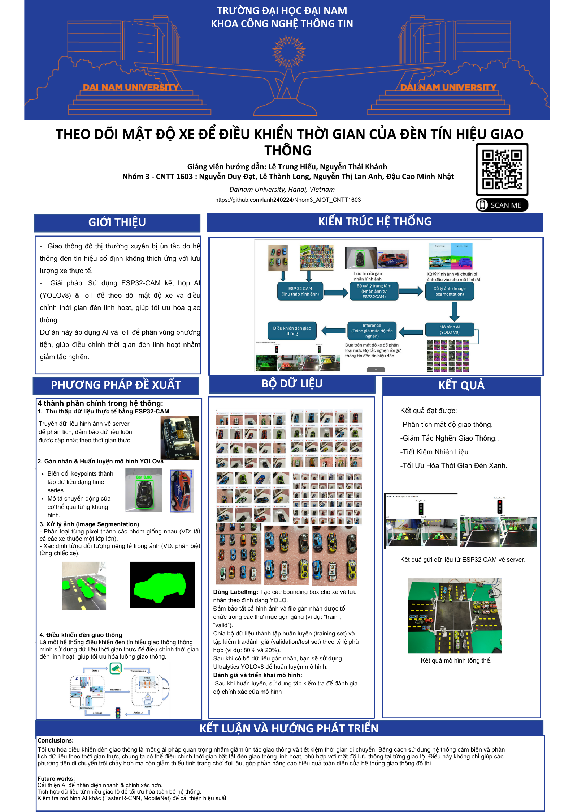

# 🚦 Hệ Thống Giám Sát Mật Độ Giao Thông Dùng Flask & YOLOv8
<p align="center">
  
  
</p>

## 📌 Giới thiệu

Hệ thống này là một ứng dụng web sử dụng **Flask**, **ESP32-CAM**, và **mô hình YOLOv8 segmentation** để giám sát mật độ giao thông. Hệ thống hỗ trợ:

- ✅ **Phát video trực tiếp từ ESP32-CAM**
- ✅ **Phát hiện phương tiện sử dụng YOLOv8**
- ✅ **Điều chỉnh đèn giao thông động dựa trên mật độ xe**
- ✅ **Giao tiếp WebSockets giữa máy chủ Flask và ESP32**

---

## 🏗 Hệ Thống

Hệ thống bao gồm 3 thành phần chính:

1. **Camera ESP32-CAM**: Gửi luồng video trực tiếp về máy chủ.
2. **Máy chủ Flask**: Nhận video, chạy mô hình YOLOv8 để phân tích mật độ giao thông.
3. **ESP32 Traffic Light Controller**: Điều khiển tín hiệu đèn giao thông qua WebSockets.

---

## 📂 Cấu Trúc Dự Án

```bash
TrafficAIOT/
│── .venv/                         # Môi trường ảo Python
│── .vscode/                        # Cấu hình VS Code
│── CameraWebServer_copy_/          # Mã nguồn ESP32-CAM
│── testEsp32/                      # Thư mục kiểm thử ESP32
│── traffic_density_server/         # Máy chủ Flask xử lý dữ liệu giao thông
│   ├── templates/                  # Giao diện HTML
│   ├── app.py                      # Main Flask app
│   ├── camera.py                   # Xử lý luồng camera ESP32-CAM
│   ├── traffic.py                   # Logic điều khiển giao thông
│   ├── websocket_client.py         # Kết nối WebSocket với ESP32
│   ├── yolov8m-seg.pt              # Mô hình YOLOv8
│── Traffic_Ws_Server/               # Máy chủ WebSocket
│   ├── __pycache__/                 # Cache file Python
│   ├── app.py                       # Máy chủ WebSocket
│   ├── config.py                    # Cấu hình WebSocket
│   ├── traffic.py                    # Xử lý logic điều khiển giao thông
│   ├── websocket_client.py          # Kết nối WebSocket với ESP32
│── README.md                        # Hướng dẫn sử dụng
│── requirements.txt                 # Danh sách thư viện Python
│── 151.jpg, 152.jpg,...             # Ảnh minh họa
│── readImg.py                        # Script xử lý ảnh
```

---

## 🛠 Công Nghệ Sử Dụng

🔹 **Flask**: Framework backend cho máy chủ  
🔹 **Flask-SocketIO**: Kết nối WebSocket  
🔹 **OpenCV**: Xử lý video từ camera  
🔹 **YOLOv8 Segmentation**: Phát hiện phương tiện  
🔹 **ESP32-CAM**: Camera gửi luồng video  
🔹 **ESP32**: Điều khiển đèn giao thông

---

## 🔥 Yêu Cầu Hệ Thống

### 🔧 Phần cứng

✅ **ESP32-CAM**  
✅ **ESP32** (Điều khiển đèn giao thông)  
✅ **Router WiFi**

### 💻 Phần mềm

✅ **Python 3.8+**  
✅ **Flask, OpenCV, YOLOv8**

---

## 📦 Các Thư Viện Python Cần Thiết

Cài đặt các thư viện trong `requirements.txt`:

```bash
pip install -r requirements.txt

```

## 🛠 Bảng Mạch ESP32

### ESP32-CAM Streaming Video

ESP32-CAM được cấu hình để phát trực tiếp video qua URL:

### esp32cam

 - http://x.x.x.151:81/stream
 - http://x.x.x.152:81/stream
 - http://x.x.x.153:81/stream
 - http://x.x.x.154:81/stream

### ESP32 Traffic Light Controller

ESP32 nhận dữ liệu mật độ giao thông từ Flask qua WebSocket:

define RED_PIN 5
define GREEN_PIN 4
define YELLOW_PIN 15

## 🚀 Hướng Dẫn Cài Đặt & Chạy

### 1️⃣ Clone repository

Sao chép mã nguồn về máy và di chuyển vào thư mục dự án:

```bash
git clone "https://github.com/ThanhLog/AIOT"
cd TrafficAIOT
Cài đặt thư viện
Cài đặt các thư viện Python cần thiết từ requirements.txt:

pip install -r requirements.txt

3Tải mô hình YOLOv8
Tải mô hình YOLOv8 Segmentation và lưu vào thư mục traffic_density_server/:
wget https://github.com/ultralytics/assets/releases/download/v0.0.0/yolov8m-seg.pt

Chạy máy chủ Flask
Di chuyển vào thư mục traffic_density_server và chạy Flask server:
cd traffic_density_server
python app.py
Sau đó truy cập trình duyệt tại:
http://localhost:5000/


Chạy ESP32-CAM
Nạp code vào ESP32-CAM để phát luồng video.
Đảm bảo camera hoạt động tại địa chỉ:

http://x.x.x.151:81/stream
http://x.x.x.152:81/stream
http://x.x.x.153:81/stream
http://x.x.x.154:81/stream


Chạy ESP32 Traffic Light Controller
Nạp code vào ESP32 để kết nối với WebSocket và điều khiển đèn giao thông.
Các chân kết nối:

define RED_PIN  5
define GREEN_PIN  4
define YELLOW_PIN  15
Mã nguồn nằm trong thư mục Traffic_Ws_Server/.

```

